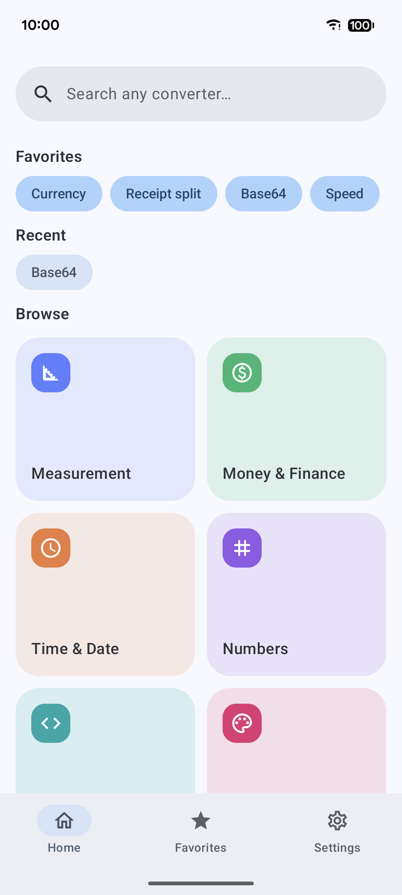
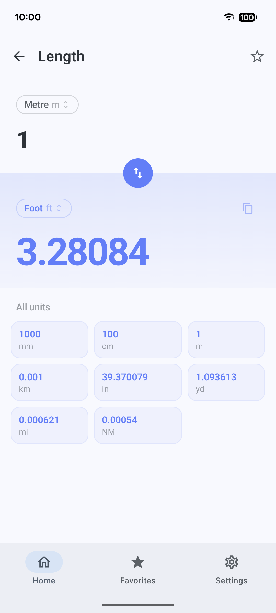
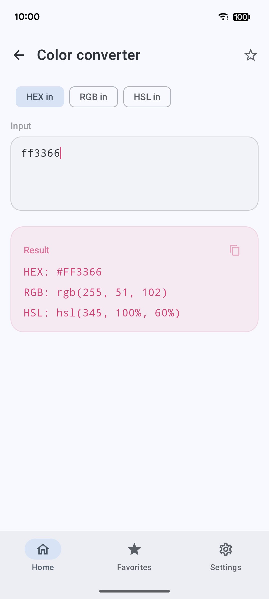
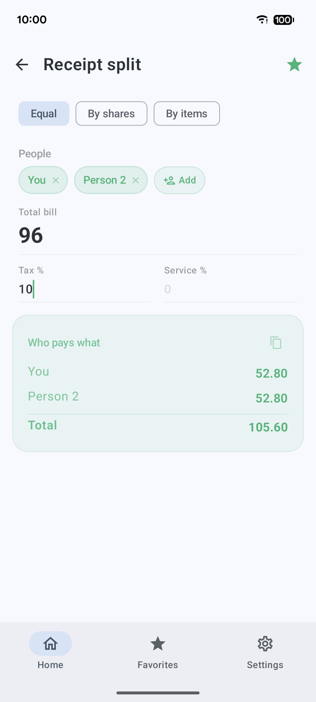
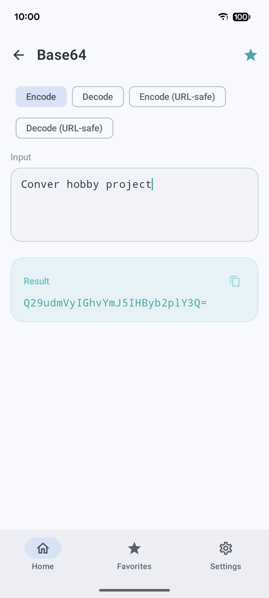
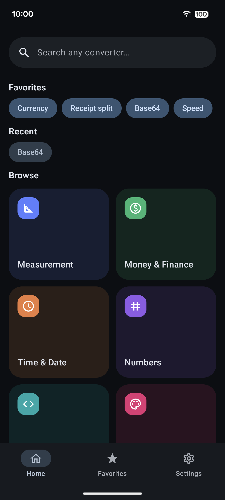

<div align="center">


# Conver

A cross-platform converter app - around 60 converters across measurement, money,
time, numbers, developer/text, color, and everyday categories, in one app that
works entirely offline on Android, Desktop, and Web.

</div>

---

Conver is a personal project: I wanted the handful of converters I keep googling
- length and temperature, base64 and hashes, hex colors, currency, Roman
numerals, a tip and receipt split - in a single Compose app that opens instantly
and runs without a network connection, instead of a different ad-filled website
for each one.

Everything is computed on-device. There's no backend and no tracking; the
catalog of converters is built into the app.

## Platforms

- **Android** - APK, minSdk 23
- **Desktop** - native installers for Windows (.msi), macOS (.dmg), and Linux (.deb)
- **Web** - runs in the browser via Kotlin/Wasm, hosted on GitHub Pages (iOS support is in progress)

## Screenshots

|                             Home                             |                        Measurement                         |                          Color                           |
|:------------------------------------------------------------:|:----------------------------------------------------------:|:--------------------------------------------------------:|
|     |  |      |
|                        Receipt split                         |                           Base64                           |                        Dark theme                        |
|  |       |  |

## What it does

- **Converters** - ~60 of them across seven categories: Measurement, Money &
  Finance, Time & Date, Numbers, Developer & Text, Color and Everyday (length,
  mass, temperature, number bases, Roman numerals, base64, URL encoding, hashes,
  hex/RGB/HSL color, timestamps, shoe & clothing sizes, and more).
- **Calculators** - input-form converters like tip and tax that go beyond a
  simple from/to swap.
- **Receipt split** - split a bill equally or by item across people, with tax
  and service percentages.
- **Search** - fuzzy search across every converter and its units.
- **Favorites** - star the converters you use most for quick access.

**Currency and crypto rates are hardcoded seed values, not live.** They're there
so the converters work offline and out of the box; they drift from the real
market and are not meant for anything you'd actually trade on. Wiring them to a
live source is a later upgrade.

### Stack

Kotlin Multiplatform · Compose Multiplatform (Material 3)
· Koin for DI · Room + DataStore · kotlinx-serialization
& kotlinx-datetime · AGP 9. `minSdk` 23 (Android), `targetSdk` 36.

## Building

You'll need Android Studio (or just the SDK) and a JDK; the Gradle wrapper
handles the rest.

```bash
# install the debug build on a connected device/emulator
./gradlew :androidApp:installDebug

# run the desktop app
./gradlew :desktopApp:run

# run the web app in a local browser
./gradlew :webApp:wasmJsBrowserDevelopmentRun
```

The debug Android app installs as **Conver🐛** with a `.debug` suffix, so it sits happily
next to a release install.

### Tests

```bash
./gradlew test    # unit tests (converter maths, search) - offline
```

### Release builds

Pushing a `v*` tag triggers the release workflow, which:
- builds and publishes signed Android APKs,
- builds native desktop installers on Windows, macOS, and Linux and attaches them to the GitHub Release,
- builds the Wasm web bundle, attaches it as a zip, and deploys it to GitHub Pages.

The Android signing config is read from environment variables to keep secrets out of the repo.
See [`RELEASE.md`](RELEASE.md) for keystore creation, GitHub secrets, and Pages setup.

```bash
export KEYSTORE_FILE=/path/to/release-key.jks
export KEYSTORE_PASSWORD=...
export KEY_ALIAS=...
export KEY_PASSWORD=...

./gradlew assembleRelease
```

## Disclaimer

Conver is an unofficial, non-commercial hobby project provided as-is. Conversions
are best-effort, and the bundled currency/crypto rates are static - double-check
anything that actually matters against an authoritative source.
